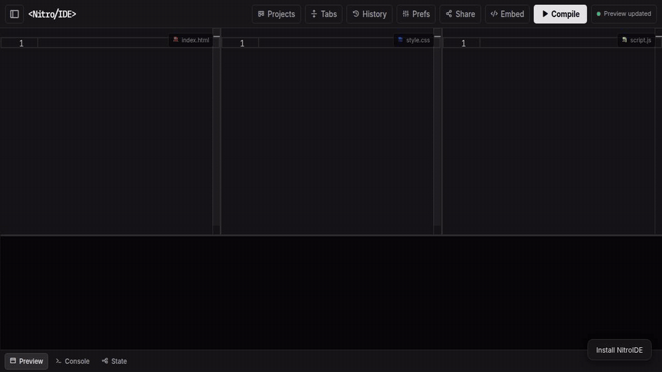

<div align="center">


# ⚡ NitroIDE

### Code locally. Execute instantly.

<p>
  <a href="https://nitroide.com/">
    
  </a>
  <a href="https://nitroide.com/docs.html">
    
  </a>
  <a href="https://github.com/nitroideofficial/nitroide">
    
  </a>
  
  
</p>



</div>

---

## 🚀 What is NitroIDE?

NitroIDE is a **zero-latency, browser-based IDE** that runs entirely on the client side.

No installs. No backend. No delays.

> Your code runs instantly inside your browser — just like it should.

---

## ✨ Features

* ⚡ Instant execution (no server round-trip)
* 🔥 Live preview
* 💻 Monaco Editor (VS Code engine)
* 📦 Virtual File System (multi-file support)
* 🧠 Built-in CLI console
* 📱 Device preview (responsive testing)
* 🔒 100% client-side privacy
* 💾 Export as ZIP or single HTML
* 🤖 Built-in AI pair programmer — bring your own key (Groq, Gemini, OpenRouter, OpenAI, SambaNova); surgical find/replace edits with diff preview and one-click restore

---

## 🆕 What's New — v30 "The AI Update" (October 2026)

* 🤖 **AI pair programmer, rebuilt** — conversational chat sidebar: smart file picker (CSS fixes go to CSS, structure to HTML, logic to JS), surgical find/replace edits with diff previews
* 🔑 **Bring your own key** — Groq, Gemini, OpenRouter, OpenAI with auto-detection; keys stay in your browser, never touch our servers. SambaNova works via a Cloudflare Worker proxy (SambaNova blocks browsers directly) — your key passes through the proxy but is never stored or logged
* 🔄 **Auto provider fallback** — rate-limited? The AI silently switches to your next saved key
* 🛡️ **Trust controls** — auto-apply off by default, checkpoint + one-click Restore before every apply, ambiguous edits refused instead of guessed
* 🧪 **Hardened engine** — 70+ adversarial tests: ambiguous matches blocked, malicious output validated, XSS escaped

Full details: https://nitroide.com/changelog.html

---

## 🖥️ Live Demo

👉 https://nitroide.com/

---

## 🧠 How It Works

NitroIDE uses:

* `iframe + srcdoc` for live execution
* Monaco for editing
* local browser memory instead of servers

Result:
👉 ⚡ zero latency
👉 🔒 full privacy

---

## 🛠️ CLI Commands

```bash id="cmds01"
> install tailwind
> install react
> export zip
> export html
> format
> clear
```

---

## 💻 Run Locally

```bash id="local01"
git clone https://github.com/nitroideofficial/nitroide.git
cd nitroide
```

```bash id="local02"
# Python
python -m http.server 8000

# Node
npx serve .
```

👉 Open: http://localhost:8000

---

## 🏗️ Tech Stack

* HTML5
* CSS3
* JavaScript (ES6+)
* Monaco Editor
* JSZip
* Phosphor Icons

---

## 🤝 Contributing

Want to improve NitroIDE?

* Fork the repo
* Make changes
* Open a PR

---

## 🌐 Connect

* 🌍 Website: https://nitroide.com/
* 🐦 X: https://x.com/trynitroide
* 📸 Instagram: https://instagram.com/nitroideofficial

---

## 📜 License

MIT License © 2026 NitroIDE

---

<div align="center">

⭐ If you like NitroIDE, give it a star

</div>
